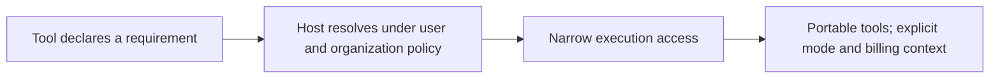
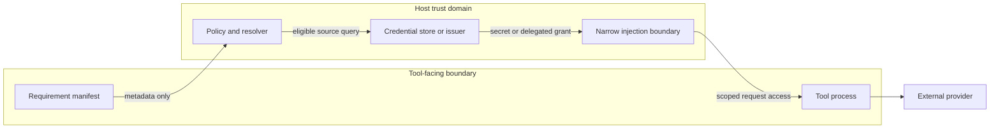

# Xenia

Xenia is a research project and draft specification for a portable credential-provisioning contract. A tool would declare what access it needs; a host would resolve an eligible credential under user choice and organization policy without putting durable secrets in the declaration.

> **Maturity:** research and draft specification only. There is no runnable broker, SDK, OAuth flow, conformance suite, or accepted standard in this repository.

## The proposition

Today, tools and hosts often couple credential setup, storage assumptions, fallback behavior, and provider-specific error handling. Xenia explores a boundary where tools state requirements and hosts satisfy them through existing authorization, identity, and secret-management systems.

The proposed modes are:

- **Trial:** limited access offered for evaluation, with explicit limits and no silent paid conversion.
- **BYOK:** a key or grant supplied and controlled by the user or organization.
- **Managed:** access provisioned and governed by the host or organization, including policy and billing attribution.

The taxonomy describes who supplies and governs access. It does not replace the underlying mechanism: OAuth, MCP authorization, workload identity, provider-native credentials, and vaults remain distinct systems that a future host might use.

## Conceptual trust boundary

The diagram is conceptual, not an implementation claim. A future design must specify exactly which components may access raw credentials; the draft prefers short-lived, audience-bound access and secret injection at the narrowest practical boundary.

## Non-goals

Xenia is not a secret manager, OAuth or OIDC replacement, identity provider, universal authorization protocol, production implementation, or accepted standard. It does not normalize provider APIs. This repository does not currently offer software to install or run.

## Current status

| Area | Status | Where to follow it |
|---|---|---|
| Proposition and terminology | Research proposal | This README and [project principles](PRINCIPLES.md) |
| RFC-0001 | **Draft; not accepted** | [Read the proposal](docs/rfcs/0001-credential-provisioning-contract.md) |
| Prior-art synthesis | Research input, reconciled but non-authoritative | [Research synthesis](docs/research/credential-provisioning-synthesis.md) |
| Recommendation decisions | Mixed pending / needs verification; none accepted by publication alone | [Recommendation register](docs/specification-status.md) |
| Implementation and conformance | Not implemented | [RFC lifecycle](GOVERNANCE.md#rfc-lifecycle) |

Open decisions include handle transport, privacy and billing disclosure fields, provider identifiers, compound requirements, trial controls, OpenAPI/MCP relationships, and future conformance governance. Their status is recorded in the [recommendation register](docs/specification-status.md), not inferred from research prose.

## Read the proposal

Start with [RFC-0001: Xenia Credential Provisioning Contract](docs/rfcs/0001-credential-provisioning-contract.md). Then review the [recommendation register](docs/specification-status.md) and [evidence register](docs/research/evidence-register.md) to distinguish draft text, research interpretation, verified primary-source facts, and unverified leads.

## Documentation

- [RFC-0001](docs/rfcs/0001-credential-provisioning-contract.md) — recovered from draft PR #2; remains Draft.
- [Specification status and recommendation decisions](docs/specification-status.md)
- [Primary-source and evidence register](docs/research/evidence-register.md)
- [Research index](docs/research/README.md), including preserved [Claude](docs/research/findings/claude-findings.md) and [Perplexity](docs/research/findings/perplexity-findings.md) inputs.
- [Governance and RFC lifecycle](GOVERNANCE.md)
- [Contributing](CONTRIBUTING.md)
- [Security reporting](SECURITY.md)
- [Project principles](PRINCIPLES.md) and [specification license](SPEC-LICENSE.md)
