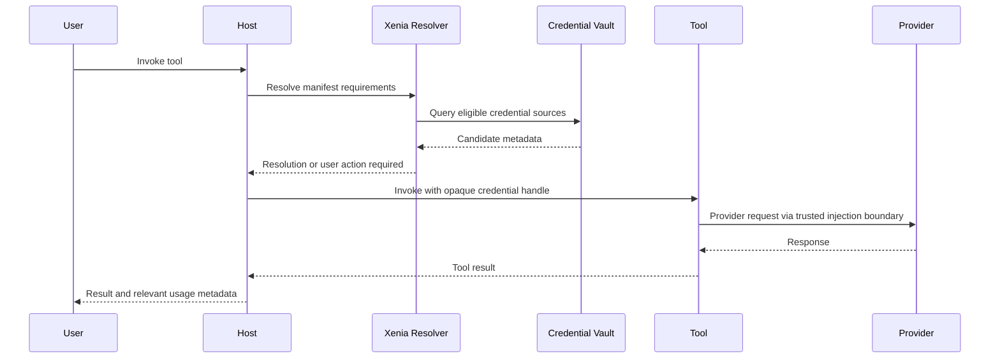

# RFC-0001: Xenia Credential Provisioning Contract

- **Status:** Draft
- **Authors:** Xenia maintainers
- **Created:** 2026-07-24
- **License:** CC BY 4.0
- **Provenance:** Recovered from draft PR #2 (`feature/bootstrap-repo`, commit `d925f13`) and published without changing its Draft status.

> This document is a proposal, not an accepted standard or implementation. Research recommendations are tracked separately in the [specification status register](../specification-status.md); publication does not adopt them.

## Summary

Xenia defines a vendor-neutral contract through which tools declare the credentials they require and host platforms satisfy those requirements using trial tokens, bring-your-own-key credentials, or managed credentials.

The central principle is that credentials are a platform concern, not a tool concern.

## Motivation

Tools that call third-party APIs usually implement their own credential prompts, storage conventions, environment variables, trial logic, error handling, and fallback behavior. This produces duplicated security-sensitive code, inconsistent user experiences, and tight coupling between tools and hosts.

A common credential contract allows:

- tools to describe requirements without owning secret lifecycle;
- hosts to provide a consistent onboarding and policy experience;
- users to choose between trials, their own keys, and managed access;
- organizations to apply policy centrally;
- providers to expose controlled evaluation paths;
- ecosystems to test compatibility through a conformance suite.

## Goals

1. Define a portable credential-requirement manifest.
2. Support trial, BYOK, and managed credential modes.
3. Keep secret material outside tool manifests, logs, and model context.
4. Make resolution deterministic and auditable.
5. Preserve explicit user choice and organizational policy.
6. Provide actionable failure states when no credential can be resolved.
7. Support future credential types beyond static API keys.

## Non-goals

- Defining a universal identity protocol.
- Replacing OAuth, OIDC, cloud secret managers, or provider-native key systems.
- Mandating a single user interface.
- Requiring hosts to support every credential mode.
- Allowing tools to read or persist raw credentials without an explicit grant.

## Terminology

- **Tool:** Executable capability that needs access to an external provider.
- **Host:** Runtime or platform that invokes the tool and resolves credentials.
- **Provider:** External service for which credentials are required.
- **Credential requirement:** Declarative description of what the tool needs.
- **Credential source:** Trial, BYOK, or managed mechanism capable of satisfying a requirement.
- **Credential handle:** Opaque, short-lived reference supplied to the execution boundary instead of exposing a durable secret.
- **Resolution:** Deterministic selection of an eligible credential source.

## Credential modes

### Trial

A trial credential is provisioned by a provider or host for evaluation and onboarding. Trial credentials SHOULD be scoped, rate-limited, time-bounded, attributable, and clearly represented to the user.

A host MUST NOT silently transition a user from a free trial to a paid credential.

### Bring your own key

A BYOK credential is supplied and controlled by a user or organization. The host SHOULD validate it before first use, store it in an appropriate secret system, expose its ownership and provider, and support revocation or replacement.

### Managed

A managed credential is provisioned and governed by the host or organization. The host is responsible for policy, billing attribution, rotation, and incident response.

## Tool manifest

A tool declares one or more credential requirements. The following example is illustrative:

```yaml
xenia: "1.0"
credentials:
  - id: primary-model
    provider: anthropic
    kind: api-key
    required: true
    accepted_modes:
      - trial
      - byok
      - managed
    scopes:
      - messages:create
    constraints:
      regions:
        - us
        - eu
    user_message: "Xenia needs access to an Anthropic model provider."
```

Each requirement MUST include a stable `id`, a `provider`, a credential `kind`, and accepted modes. A requirement MAY include scopes, regional constraints, capability constraints, and user-facing context.

The manifest MUST NOT contain secret material.

## Resolution model

Resolution is a host operation. A tool does not choose or inspect the durable source.

The host evaluates candidates using the following precedence inputs:

1. explicit user choice for the current invocation or installation;
2. organization policy;
3. credential availability and validity;
4. tool-declared accepted modes;
5. host-configured defaults;
6. trial availability and remaining allowance.

There is intentionally no universal hard-coded order such as managed, then BYOK, then trial. Hosts MUST make precedence visible and deterministic. Explicit user choice and organization policy take priority over implicit fallback.

A conforming host MUST NOT fall back from BYOK or managed credentials to a trial credential when doing so would change privacy, retention, region, capability, or billing semantics without disclosure and consent.

## Resolution result

A successful resolution returns metadata and an opaque execution handle:

```json
{
  "requirement_id": "primary-model",
  "provider": "anthropic",
  "mode": "byok",
  "credential_handle": "xenia://handle/01J...",
  "expires_at": "2026-07-25T03:00:00Z",
  "policy": {
    "organization": "example-org",
    "region": "us"
  }
}
```

The handle SHOULD be short-lived, audience-bound, scope-bound, and single-purpose. Raw durable credentials SHOULD be injected only at the narrowest trusted execution boundary.

## Runtime flow



## Missing-credential experience

When no credential can be resolved, the host returns a structured action state rather than a generic authentication error:

- start an available trial;
- add a personal key;
- request access to a managed credential;
- choose another supported provider;
- cancel the invocation.

The user interface SHOULD disclose provider, mode, expected billing owner, trial limits, requested scopes, and relevant data-handling differences.

## Trial controls

Trial support is an onboarding mechanism, not an authorization bypass. A conforming trial implementation SHOULD include:

- per-user or per-organization attribution;
- rate and spend limits;
- expiration and revocation;
- abuse controls;
- clear quota reporting;
- no automatic paid conversion;
- policy-defined data handling;
- provider-specific terms surfaced before activation.

Tools MUST NOT assume that a trial is available.

## BYOK controls

Hosts supporting BYOK SHOULD provide:

- secure entry and validation;
- encrypted storage using a secret manager or equivalent;
- masked display and non-recoverable UI where practical;
- rotation and revocation;
- ownership metadata;
- separation between personal and organization credentials;
- audit events without secret values;
- protections against prompt, log, trace, and error leakage.

## Security model

### Trust boundaries

The system distinguishes among the user interface, host control plane, credential vault, execution plane, tool process, and external provider. Implementations MUST document which boundaries can access raw secret material.

### Secret minimization

Raw durable credentials MUST NOT appear in:

- tool manifests;
- model prompts or conversation history;
- ordinary application logs;
- analytics events;
- exception payloads;
- conformance-test fixtures.

### Least privilege

Credentials and handles SHOULD be scoped to the minimum provider permissions, audience, region, tool, and lifetime necessary.

### Audit

Resolution, access, validation, rotation, failure, and revocation events SHOULD be auditable. Audit records MUST identify metadata such as actor, tool, provider, mode, policy, timestamp, and outcome without recording secrets.

### Threats to address

The reference threat model MUST cover secret exfiltration, confused deputy attacks, malicious tool manifests, fallback manipulation, trial abuse, cross-tenant access, stale credentials, replay, logging leakage, and billing-owner ambiguity.

## Privacy and billing semantics

Credential modes may imply different data processing, retention, support, rate limits, and billing ownership. A host MUST treat these differences as policy-relevant, not merely implementation details.

The resolution result SHOULD make the active mode and billing owner available to the host. The host SHOULD make material differences visible to the user.

## Provider abstraction

Xenia does not normalize provider APIs. It normalizes credential requirements and resolution. Provider adapters MAY implement validation, scope discovery, OAuth exchange, token refresh, or secret injection.

## Extensibility

Future credential kinds may include OAuth grants, workload identity, delegated tokens, signed requests, cloud role assumption, device authorization, and user-consent capabilities. Extensions MUST preserve explicit policy, secret minimization, and deterministic resolution.

## Conformance

A conformance suite SHOULD test:

- manifest validation;
- accepted-mode enforcement;
- deterministic resolution;
- explicit-choice preservation;
- missing-credential action states;
- trial-limit behavior;
- no-secret logging guarantees;
- handle expiration and audience binding;
- policy conflict handling;
- material fallback disclosure.

Only implementations that pass the applicable conformance profile may use a future Xenia compatibility mark.

## Open questions

1. Should the first version standardize credential-handle transport or leave it implementation-specific?
2. Which manifest fields are mandatory for privacy and billing disclosure?
3. Should provider identifiers use a central registry or reverse-domain names?
4. How should compound requirements and multi-provider fallback be represented?
5. What minimum controls are required for a host to advertise trial support?

## Licensing and governance

Reference implementations and SDKs are licensed under the MIT License. This specification is licensed under Creative Commons Attribution 4.0 International.

The project name, logo, and compatibility marks are not granted by those licenses. Compatibility marks will be governed by transparent conformance requirements and applied in a vendor-neutral manner.

The governance objective is broad adoption and interoperability: an open specification, an open reference implementation, transparent decisions, and no privileged vendor implementation.

## Decision

This RFC proposes Xenia as the common credential provisioning boundary between tools and hosts, beginning with trial, BYOK, and managed modes.

No acceptance decision has been made. See the [recommendation register](../specification-status.md) and [evidence register](../research/evidence-register.md) for subsequent research and verification status.
